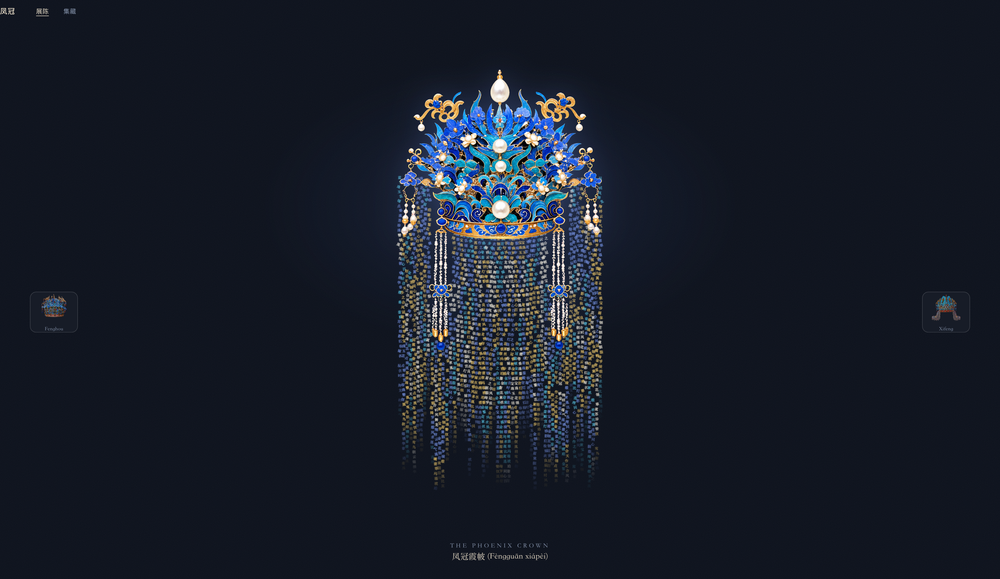
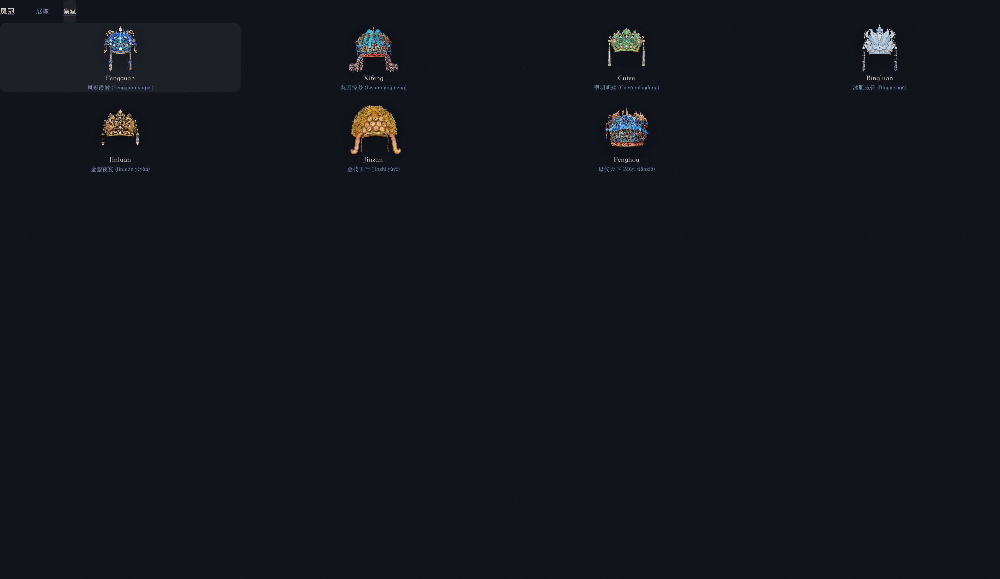
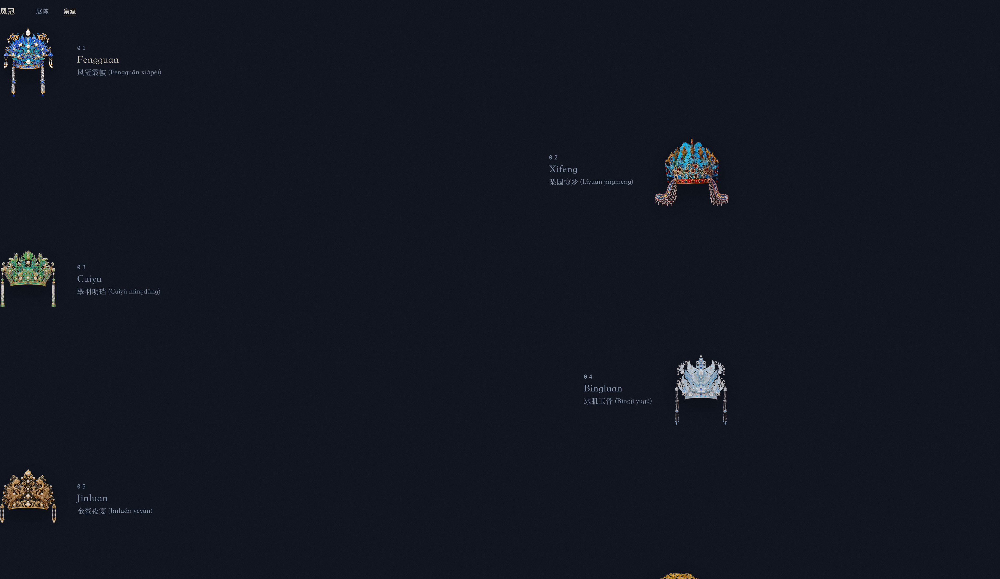
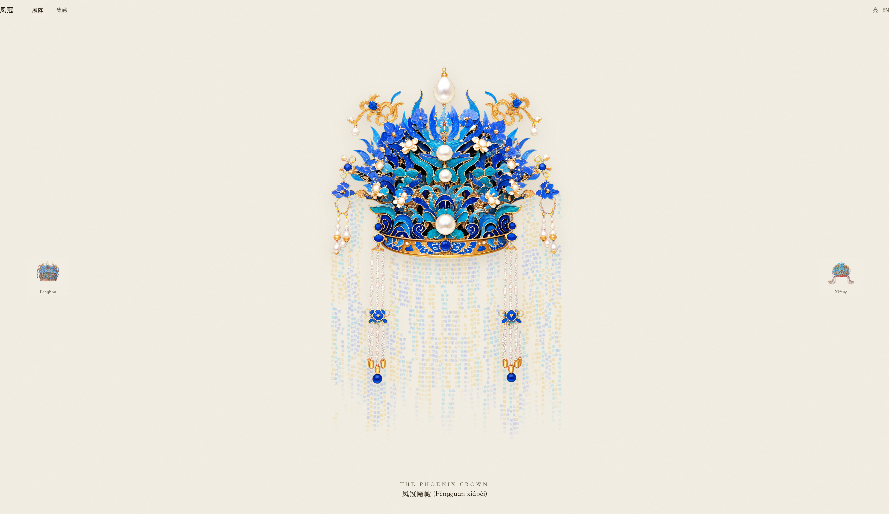
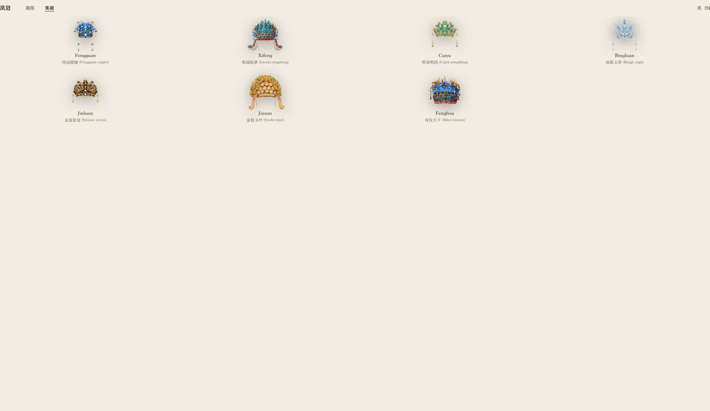

# 字符帘幕凤冠 · Phoenix Crown

汉字帘幕凤冠可视化站点 —— 对标 [`aigc17/Chinese-PhoenixCrown`](https://github.com/aigc17/Chinese-PhoenixCrown) 的混合栈重构。

## 技术栈

| 层 | 技术 | 说明 |
|---|---|---|
| 构建框架 | Vite `^8.1.4` + React `^19.2.0` + TypeScript `^7.0.2` | 纯客户端 SPA，无 SSR |
| 样式 | Tailwind CSS `^4.3.2`（`@tailwindcss/vite`） | 暗场主题，零运行时 |
| 布局引擎 | `@chenglou/pretext` `^0.0.8` | 浏览器运行时 `measureLineStats` 测真实 CJK 字宽，定列距（非固定栅格）|
| 渲染 | Canvas 2D + atlas 图集 | 每字预栅格化进离屏 canvas，`drawImage` 盖章，避免每帧 `fillText` 瓶颈 |
| 物理 / 动效 | 自写 verlet 链 | 掉落淡入（reveal）、idle breeze 微风、鼠标拨开、松手回弹（home 弹簧）|
| 拼接 | 采样凤冠 PNG alpha 轮廓 | 帘幕沿冠形垂挂，非直线 |
| 部署 | `@cloudflare/vite-plugin` `^1.44.0` + wrangler `^4.110.0` | 构建自动产出 `wrangler.json`，部署到 Cloudflare Pages |

### 依赖

**运行时（dependencies）**

| 包 | 版本 | 用途 |
|---|---|---|
| `react` | `^19.2.0` | UI 框架 |
| `react-dom` | `^19.2.0` | DOM 渲染 |
| `@chenglou/pretext` | `^0.0.8` | 字形测量（真实字宽布局）|

**开发（devDependencies）**

| 包 | 版本 | 用途 |
|---|---|---|
| `vite` | `^8.1.4` | 构建 / dev server |
| `@vitejs/plugin-react` | `^6.0.3` | React 插件 |
| `typescript` | `^7.0.2` | 类型检查 |
| `@types/react` | `^19` | React 类型 |
| `@types/react-dom` | `^19` | React DOM 类型 |
| `tailwindcss` | `^4.3.2` | 样式引擎 |
| `@tailwindcss/vite` | `^4.3.2` | Tailwind Vite 插件 |
| `@cloudflare/vite-plugin` | `^1.44.0` | Cloudflare 部署插件 |
| `wrangler` | `^4.110.0` | Cloudflare CLI |

> 包管理使用 **bun**（`bun.lock` 锁定）。也可用 npm/pnpm，但 lockfile 不同。

## 开发

```bash
bun install
bun run dev        # http://localhost:5173
bun run build      # 产出 dist/，含 wrangler.json
```

> 字体使用具名 `'Songti SC', 'Noto Serif SC', serif`。macOS 上 pretext 测量依赖真实字体，
> 缺失时回退到固定 `COL_SPACING = 8.5` 栅格。

## 目录

```
src/
  components/
    TextCurtain.tsx     # 帘幕核心：pretext 测宽 + verlet + Canvas
    DestinationScene.tsx# 单冠场景：帘幕 + 冠图 + 文案
    GalleryView.tsx     # 集藏视图
    SiteHeader.tsx      # 页头
  lib/
    destinations.ts     # 七顶冠数据（文案 / charPool / 配色 / 冠型）
    crown-art.ts        # 凤冠 PNG 资源映射
public/crowns/          # 凤冠图（对齐原项目，已获授权）
```

## 效果预览

展陈页：单冠大图居中，汉字帘幕沿冠形垂挂；左右常驻可见的「上一顶 / 下一顶」凤冠缩略预览，引导查看其余六顶。



## 集藏页 · 两种风格

默认网格视图（`GalleryView`）：



「高级画廊」变体（`GalleryViewPro`，redesign 对比用）：去卡片边框、靠留白分层、非对称行、冠图更大 + hover 光晕。通过 `?pro=1` 启用，默认仍用网格视图。



## 主题与语言

- **暗黑 / 光亮切换**：顶栏右侧按钮在 `暗 ↔ 亮` 间循环。`暗` 为默认（延续原项目暗场设计）；`亮` 为暖纸底 + 墨字 + 保留金色强调的全局强制亮场。
- **中 / 英文切换**：顶栏右侧 `中 / EN` 按钮。英文模式仅翻译 UI 标签（导航、按钮、aria），冠名与诗句保留中文（内容不译）。
  - 注：本项目的英文模式定位是 **UI 本地化**，不是全文翻译。冠名、诗句（`phrase`/`phraseNote`/`caption`）是文化内容，刻意保留中文原貌，不属于未完成的翻译缺陷。

亮场展陈页（凤冠霞帔）：



亮场集藏页：



> 信息架构决策（展陈/集藏的关系、未决问题）见 [docs/ia-decision.md](./docs/ia-decision.md)。

## 参考与来源

- **项目灵感**：参考推文 [x.com/i/status/2076410277109645741](https://x.com/i/status/2076410277109645741)
- **fork 源码**：[aigc17/Chinese-PhoenixCrown](https://github.com/aigc17/Chinese-PhoenixCrown)
  （对应推文 [x.com/i/status/2076602891432034606](https://x.com/i/status/2076602891432034606)）

## 对齐说明

文案、`charPool`、凤冠图资源来自对标项目（已获授权用于本仓库发布）。
帘幕的**布局引擎（pretext）** 与**交互物理**为本仓库重构实现，视觉/动效对齐原项目。

## 自动 Changelog

每次 push 到 `main`，GitHub Actions（`.github/workflows/changelog.yml`）
会将本次包含的 commits 追加进 `CHANGELOG.md`。

## 部署（Cloudflare）

本项目用 `@cloudflare/vite-plugin`（Workers 模式），`bun run build` 会自动产出 `dist/wrangler.json`。

```bash
bun run build
bunx wrangler deploy          # 需先 wrangler login（或设 CLOUDFLARE_API_TOKEN）
bunx wrangler deploy --temporary   # 免登录临时预览（workers.dev 临时域名，会过期）
```

- 部署前需 `wrangler login` 或设置 `CLOUDFLARE_API_TOKEN`。
- `public/_headers` 已声明：
  - `/crowns/*` → `Access-Control-Allow-Origin: *`（凤冠 PNG 供 Canvas `getImageData` 采样轮廓，避免 CORS 失败致帘幕不渲染）
  - 全局 → `Content-Security-Policy` / `X-Content-Type-Options` / `Referrer-Policy` 等基础安全头
- 本地 `bun run dev` 同源，不触发 CORS，但生产环境依赖上述 `_headers`。

## 许可证与来源

- 凤冠 PNG 资源与文案 fork 自 [`aigc17/Chinese-PhoenixCrown`](https://github.com/aigc17/Chinese-PhoenixCrown)，
  按原项目许可使用（详见 [`LICENSE`](./LICENSE)）。
- 本仓库的布局引擎（pretext 测宽）、verlet 物理与交互为独立重构实现。
- 安全相关反馈见 [`SECURITY.md`](./SECURITY.md)。
